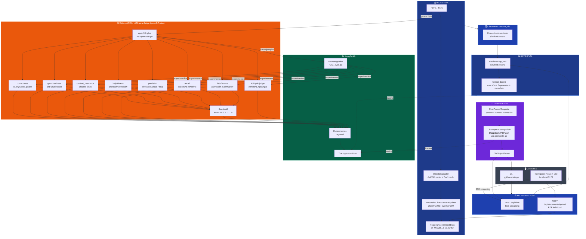

# Arquitectura del RAG



## Flujo de datos

| Etapa           | Herramienta                        | Detalle                                          |
|-----------------|------------------------------------|--------------------------------------------------|
| **Carga**       | `DirectoryLoader`                  | PDFs (`PyPDFLoader`) + TXTs (`TextLoader`)       |
| **Chunking**    | `RecursiveCharacterTextSplitter`   | 1000 chars, solapamiento 200                     |
| **Embeddings**  | `HuggingFaceEmbeddings`            | `all-MiniLM-L6-v2`, CPU, normalizado             |
| **Vector DB**   | `ChromaDB`                         | Persistente en `chroma_db/`                      |
| **Retrieval**   | `vectorstore.as_retriever(k=5)`    | Búsqueda por similitud de coseno                 |
| **Prompt**      | `ChatPromptTemplate`               | System prompt en español + contexto + pregunta   |
| **LLM**         | `ChatOpenAI` (compatible)          | `deepseek-v4-flash` via `opencode-go`            |
| **Output**      | `StrOutputParser`                  | Respuesta en texto plano                         |
| **Tracing**     | `LangSmith`                        | Proyecto `RAG_testing`                           |

## Evaluación con LangSmith

### Métricas (LLM-as-a-Judge con `qwen3.7-plus`)

| # | Métrica             | Qué evalúa                                                              | Escala |
|---|---------------------|-------------------------------------------------------------------------|--------|
| 1 | `correctness`       | Similitud de la respuesta generada vs. respuesta golden de referencia   | 0.0–1.0 |
| 2 | `groundedness`      | Qué tanto se respalda la respuesta en los documentos recuperados (anti-alucinación) | 0.0–1.0 |
| 3 | `context_relevance` | Qué tan relevantes son los chunks recuperados para la pregunta          | 0.0–1.0 |
| 4 | `helpfulness`       | Utilidad, claridad y concisión de la respuesta para el usuario          | 0.0–1.0 |
| 5 | `precision`         | Fracción de los documentos recuperados que son realmente relevantes     | 0.0–1.0 |
| 6 | `recall`            | Si los documentos recuperados contienen TODA la info necesaria para responder | 0.0–1.0 |
| 7 | `faithfulness`      | Cada afirmación individual de la respuesta es directamente inferible del contexto (más estricto que groundedness) | 0.0–1.0 |
| 8 | `threshold`         | Compuesto binario: 1.0 si TODAS las 7 métricas >= umbral (defecto 0.7), 0.0 si alguna falla | 0 o 1 |
| — | **A/B pair judge**  | Compara dos respuestas (de distintos prompts) y declara ganador con scores | winner + scores |

### Flujo de evaluación

```bash
# 1. Generar dataset golden sintético desde tus PDFs
python evaluate.py gen-dataset --docs-dir docs --n-questions 10

# 2. Ejecutar el RAG sobre el dataset y medir las 4 métricas
python evaluate.py run --dataset RAG_eval_qa

# 3. Comparar dos system prompts (A/B testing)
python evaluate.py ab --dataset RAG_eval_qa --prompt-a prompt_a.txt --prompt-b prompt_b.txt
```

- **Dataset**: los pares pregunta/respuesta golden se generan automáticamente con el juez (`qwen3.7-plus`) desde fragmentos de tus PDFs y se suben a LangSmith.
- **Experimento**: `evaluate.py run` ejecuta el RAG sobre cada pregunta del dataset, invoca los 4 jueces, y publica los resultados en LangSmith.
- **A/B**: `evaluate.py ab` compara dos system prompts distintos sobre el mismo dataset con un juez pareado que decide ganador.

## Capa Web (front-end + API)

| Componente      | Carpeta        | Detalle                                                       |
|-----------------|----------------|---------------------------------------------------------------|
| **Front-end**   | `web/`         | React 18 + Vite. Chat con streaming, citas, upload PDF, tema. |
| **API**         | `api/`         | FastAPI. Rutas `/api/chat` (SSE) y `/api/documents/upload`.   |
| **Streaming**   | SSE            | Server-Sent Events: evento `sources` + `token`*N + `done`.    |

### Ejecutar el backend (FastAPI)

```bash
pip install -r requirements.txt   # incluye fastapi, uvicorn, python-multipart
uvicorn api.server:app --reload --port 8000
```

### Ejecutar el front-end (React + Vite)

```bash
cd web
npm install
npm run dev    # http://localhost:5173 (proxy /api -> localhost:8000)
```

> Primero indexa los materiales del curso con el CLI si la base vectorial
> aún no existe: `python main.py ingest <docs_dir>`.

### Build de producción del front-end

```bash
cd web
npm run build    # genera web/dist/
```


## Stack tecnológico

```
┌─────────────────────────────────────────────────────┐
│                    LangChain 1.3                     │
│  ┌─────────────┐  ┌──────────────┐  ┌────────────┐ │
│  │ langchain-   │  │ langchain-   │  │ langchain-  │ │
│  │ community    │  │ chroma       │  │ huggingface │ │
│  └─────────────┘  └──────────────┘  └────────────┘ │
│  ┌─────────────┐  ┌──────────────┐  ┌────────────┐ │
│  │ langchain-   │  │ langchain-   │  │ langchain-  │ │
│  │ openai       │  │ ollama       │  │ text_split  │ │
│  └─────────────┘  └──────────────┘  └────────────┘ │
├─────────────────────────────────────────────────────┤
│  ChromaDB  │  sentence-transformers  │  LangSmith   │
├─────────────────────────────────────────────────────┤
│  DeepSeek V4 Flash  │  OpenCode Go  │  HuggingFace │
└─────────────────────────────────────────────────────┘
```
