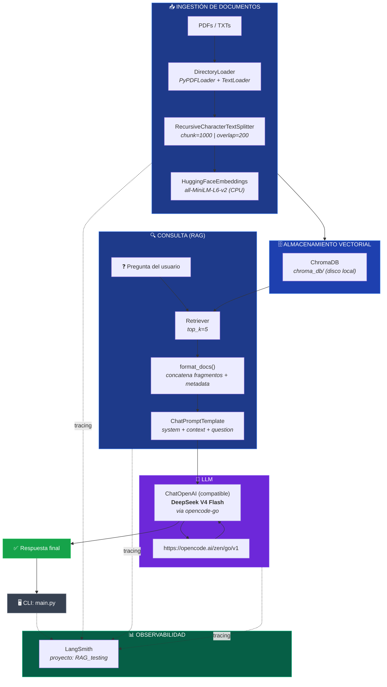
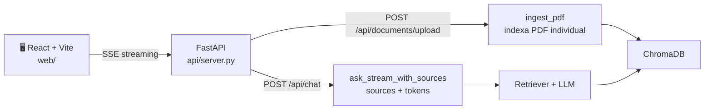

# Arquitectura del RAG



## Flujo de datos

| Etapa           | Herramienta                        | Detalle                                          |
|-----------------|------------------------------------|--------------------------------------------------|
| **Carga**       | `DirectoryLoader`                  | PDFs (`PyPDFLoader`) + TXTs (`TextLoader`)       |
| **Chunking**    | `RecursiveCharacterTextSplitter`   | 1000 chars, solapamiento 200                     |
| **Embeddings**  | `HuggingFaceEmbeddings`            | `all-MiniLM-L6-v2`, CPU, normalizado             |
| **Vector DB**   | `ChromaDB`                         | Persistente en `chroma_db/`                      |
| **Retrieval**   | `vectorstore.as_retriever(k=5)`    | Búsqueda por similitud de coseno                 |
| **Prompt**      | `ChatPromptTemplate`               | System prompt en español + contexto + pregunta   |
| **LLM**         | `ChatOpenAI` (compatible)          | `deepseek-v4-flash` via `opencode-go`            |
| **Output**      | `StrOutputParser`                  | Respuesta en texto plano                         |
| **Tracing**     | `LangSmith`                        | Proyecto `RAG_testing`                           |

## Capa Web (front-end + API)



| Componente      | Carpeta        | Detalle                                                       |
|-----------------|----------------|---------------------------------------------------------------|
| **Front-end**   | `web/`         | React 18 + Vite. Chat con streaming, citas, upload PDF, tema. |
| **API**         | `api/`         | FastAPI. Rutas `/api/chat` (SSE) y `/api/documents/upload`.   |
| **Streaming**   | SSE            | Server-Sent Events: evento `sources` + `token`*N + `done`.    |

### Ejecutar el backend (FastAPI)

```bash
pip install -r requirements.txt   # incluye fastapi, uvicorn, python-multipart
uvicorn api.server:app --reload --port 8000
```

### Ejecutar el front-end (React + Vite)

```bash
cd web
npm install
npm run dev    # http://localhost:5173 (proxy /api -> localhost:8000)
```

> Primero indexa los materiales del curso con el CLI si la base vectorial
> aún no existe: `python main.py ingest <docs_dir>`.

### Build de producción del front-end

```bash
cd web
npm run build    # genera web/dist/
```


## Stack tecnológico

```
┌─────────────────────────────────────────────────────┐
│                    LangChain 1.3                     │
│  ┌─────────────┐  ┌──────────────┐  ┌────────────┐ │
│  │ langchain-   │  │ langchain-   │  │ langchain-  │ │
│  │ community    │  │ chroma       │  │ huggingface │ │
│  └─────────────┘  └──────────────┘  └────────────┘ │
│  ┌─────────────┐  ┌──────────────┐  ┌────────────┐ │
│  │ langchain-   │  │ langchain-   │  │ langchain-  │ │
│  │ openai       │  │ ollama       │  │ text_split  │ │
│  └─────────────┘  └──────────────┘  └────────────┘ │
├─────────────────────────────────────────────────────┤
│  ChromaDB  │  sentence-transformers  │  LangSmith   │
├─────────────────────────────────────────────────────┤
│  DeepSeek V4 Flash  │  OpenCode Go  │  HuggingFace │
└─────────────────────────────────────────────────────┘
```
